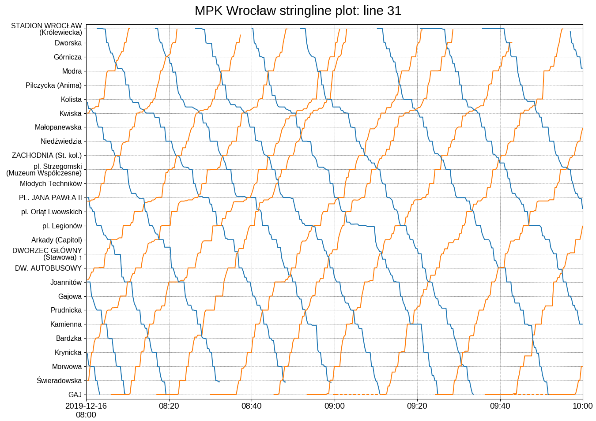
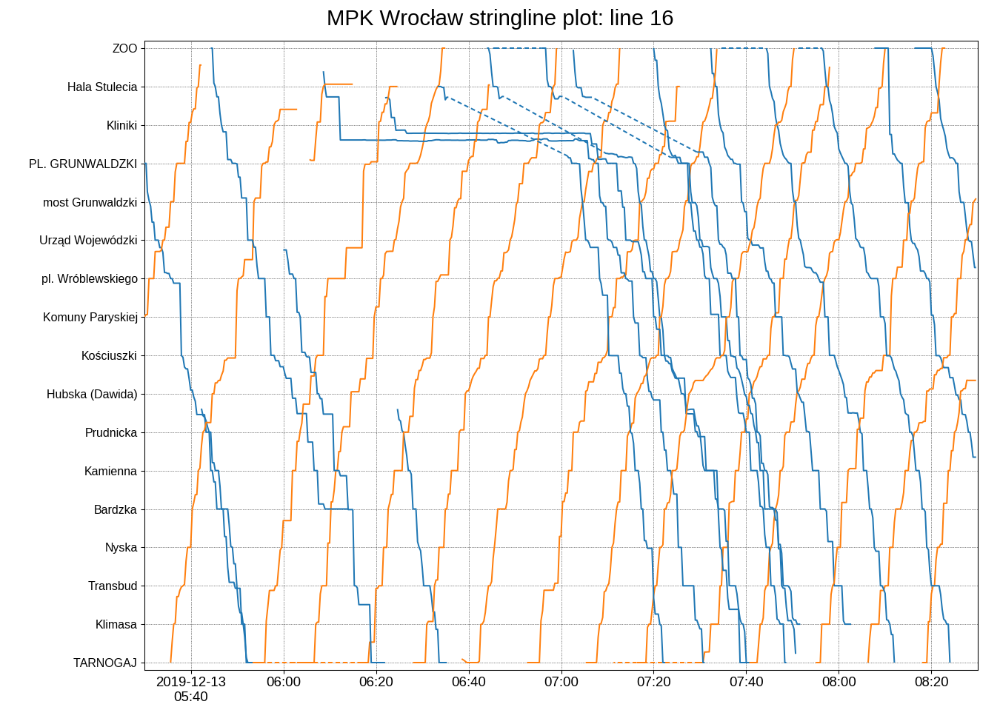

# Stringline plots for buses and trams in Wrocław

## How it works

### Getting data

Miejskie Przedsiębiorstwo Komunikacyjne &mdash; the transportation company in Wrocław (<http://mpk.wroc.pl/>) provides positions of their buses and trams by querying their API endpoint, e.g.:

```bash
$ curl --insecure https://mpk.wroc.pl/bus_position --data 'busList[][]=8&busList[][]=31'
[
    {"name":"31","type":"tram","y":17.01899,"x":51.09238,"k":14482003},
    {"name":"31","type":"tram","y":16.959703,"x":51.140003,"k":14481968},
    {"name":"8","type":"tram","y":17.038694,"x":51.108288,"k":14483257},
    ...
]
```

MPK also provides GPS coordinates of bus/tram stops and list of stops per route.


### Processing

The location data is converted into the position along the route, i.e. last visited stop and percentage of distance covered to the next one. Data are collected a couple of times per minute and saved in the database.


### Data visualisation

provided by a Django app, also on <https://mpk.tk.usermd.net/>.


### Sample results

 * **Normal data**


 * **Some delays**



## Installation

 * Install liberation fonts from <https://github.com/liberationfonts/liberation-fonts>
 * Clone the repository
 * Create virtual environment
 * Create `wsgi.py`, `manage.py` and files in `mpk/settings/` based on their `.template` versions
 * Update crontab based on `MANAGEMENT/0-crontab`
 * Add routes as described in the following section


## Adding route

Before adding the first route, add stops locations:
 * Download `OtwartyWroclaw_rozklad_jazdy_GTFS.zip` from <https://www.wroclaw.pl/open-data/dataset/rozkladjazdytransportupublicznegoplik_data>
 * Copy `stops.txt` to `mpk/resources/` <br/>
   (Version from December 2019 is in `MANAGEMENT/1-add-stops-and-routes/sample-data/stops.csv`)

Adding route:
 * Download `XML-rozkladyjazdy.zip` from <https://www.wroclaw.pl/open-data/dataset/rozkladjazdytransportupublicznegoxml_data>
 * Copy `(line).xml` to `mpk/resources/routes/` <br/>
 * If needed, manually modify `(line).xml` <br/>
   There can be only two route versions ("wariant" tags) in the file, corresponding to the two directions of the route. They should have the same stop names, in reverse order. Most of the time, the ones we are interested in are the first ones in the file. 
    * Stops in one direction, e.g. "DWORZEC GŁÓWNY (Stawowa)" from line 31, might be removed or copied to the route in the other direction with the same "id" parameter. `\u2191` and `\u2193` or `↑` and `↓` can be used for upwards and downwards arrow to mark stops in one direction. 
    * Stops with different names in the two directions can be removed or added with the combined name, e.g. "Urząd Wojewódzki / Poczta Główna" from line D.
    * "numer" and "czas" arguments are not read
 * Add route
   ```bash
   (env) $ ./manage.py add_route (line)
   ```
 * If needed, manually modify `display_name` in `stops_stop` table to make stop names fit on the plot.
 * (`0031.xml` and `000d.xml` from December 2019 are in `MANAGEMENT/1-add-stops-and-routes/sample-data/`)

